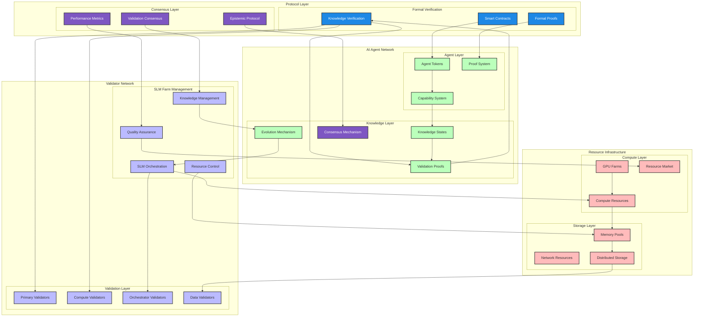

# Openware AI Protocol (Agent to Agent - A2A)

## Overview

The Openware AI Protocol represents a groundbreaking integration of epistemic logic within blockchain frameworks, specifically designed for AI Agent management and validation. At its core, the protocol implements epistemic logic principles to establish a robust validator network that facilitates the epistemic evolution of AI agents through distributed Small Language Model (SLM) farms.

The framework introduces a three-layer validation hierarchy for:
- Knowledge verification and consensus formation
- Temporal knowledge tracking and evolution
- Economic resource utilization and incentives

By embedding epistemic reasoning into blockchain protocols, we create a robust framework where:
- AI Agents operate autonomously within a decentralized ecosystem
- Validators provide SLM farms for computational resources
- Knowledge is formally verified through collective intelligence
- Model hallucination is reduced through distributed validation
- Economic sustainability is ensured through market mechanisms

Our key innovations address critical challenges in AI model hallucination and distributed knowledge validation:

### 1. Epistemic Logic-Based Validation
- Three-layer validation hierarchy for knowledge verification
- Formal framework for agent knowledge evolution
- Collective intelligence emergence through validator networks
- Reduction of model hallucination through distributed validation

### 2. Blockchain-Native AI Agents
- AI Agents as NFTs with ERC-721 extensions
- Verifiable state transitions with formal proofs
- Secure capability management and evolution
- Cross-validation mechanisms across distributed nodes

### 3. Distributed SLM Farm Network
- Validator-operated Small Language Model (SLM) farms
- Resource rental system for AI agents
- Dynamic pricing based on utilization and performance
- Economic incentives for accurate knowledge validation

## Key Features

### Validator Network
- **Primary Validators**: Blockchain state validation and network coordination
- **Compute Validators**: AI model execution and resource provision
- **Orchestrator Validators**: Agent deployment and load balancing
- **Data Validators**: Communication security and privacy preservation

### SLM Farm Economics
- Dynamic resource pricing based on market demand
- Performance-based rewards for validators and agents
- Efficient resource allocation through market mechanisms
- Sustainable network growth through aligned incentives

### Knowledge Validation
- Formal verification of AI-generated knowledge
- Cross-validation across distributed SLMs
- Network-wide confidence scoring system
- Collective intelligence for hallucination reduction

## Documentation

### Research Paper
- [Complete Paper](./PAPER.md) - Comprehensive academic paper detailing the protocol

### Technical Documentation
- [Formal Specification](./docs/validator/FORMAL_SPEC.md) - Epistemic logic framework
- [Architecture](./docs/validator/ARCHITECTURE.md) - System design and components
- [Network Roles](./docs/validator/NETWORK_ROLES.md) - Validator responsibilities

### Agent NFT System
- [Formal Specification](./docs/agent-nft/FORMAL_SPEC.md) - Formal analysis
- [Economic Model](./docs/agent-nft/ECONOMIC_MODEL.md) - Tokenomics
- [Technical Specs](./docs/agent-nft/TECHNICAL_SPECIFICATIONS.md) - Implementation
- [Feedback](./docs/agent-nft/FEEDBACK.md) - Community input

## Roadmap

### Current Development
- Core protocol implementation
- Validator network deployment
- SLM farm infrastructure
- Economic model testing

### Coming Soon
- Enhanced economic incentives
- Advanced governance features
- Extended security framework
- Large-scale network testing

## Contributors

* Paul (paul@igot.ai) - CTO of iGOT.ai
* Brian (brian@igot.ai) - Data/AI Researcher

## References

For detailed references and citations, please refer to the [Paper](./PAPER.md#references) section.

## System Architecture



### Architectural Philosophy

1. **Formal Verification Layer**
   - Mathematical proofs for knowledge validation
   - Rigorous verification of state transitions
   - Formal specification of smart contracts
   - Provable security properties

2. **Consensus Mechanisms**
   - Epistemic-based consensus protocols
   - Peer-reviewed validation mechanisms
   - Performance-based scoring system
   - Formal proof aggregation

3. **Resource Management**
   - Provably fair resource allocation
   - Quality-assured SLM operations
   - Verified computation results
   - Formal resource market dynamics

### Key Principles

1. **Scientific Rigor**
   - Peer-reviewed protocol design
   - Formal mathematical foundations
   - Provable security guarantees
   - Academic research-backed features

2. **Systematic Validation**
   - Multi-stage verification process
   - Formal proof requirements
   - Quality assurance metrics
   - Evidence-based evolution

3. **Sustainable Economics**
   - Mathematically proven incentives
   - Formal market equilibrium
   - Verified reward mechanisms
   - Sustainable growth model

The sequential flows demonstrate how agents interact with validators and each other, while the protocol specifications ensure formal verification and security at each step.


```bibtex
@InCollection{sep-logic-epistemic,
    author       = {Rendsvig, Rasmus and Symons, John},
    title        = {{Epistemic Logic}},
    booktitle    = {The {Stanford} Encyclopedia of Philosophy},
    editor       = {Edward N. Zalta and Uri Nodelman},
    howpublished = {\url{https://plato.stanford.edu/archives/sum2020/entries/logic-epistemic/}},
    year         = {2020},
    edition      = {{S}ummer 2020},
    publisher    = {Metaphysics Research Lab, Stanford University}
}
```

This work builds upon foundational research in epistemic logic, particularly the framework established by Rendsvig and Symons (2020) in the Stanford Encyclopedia of Philosophy.