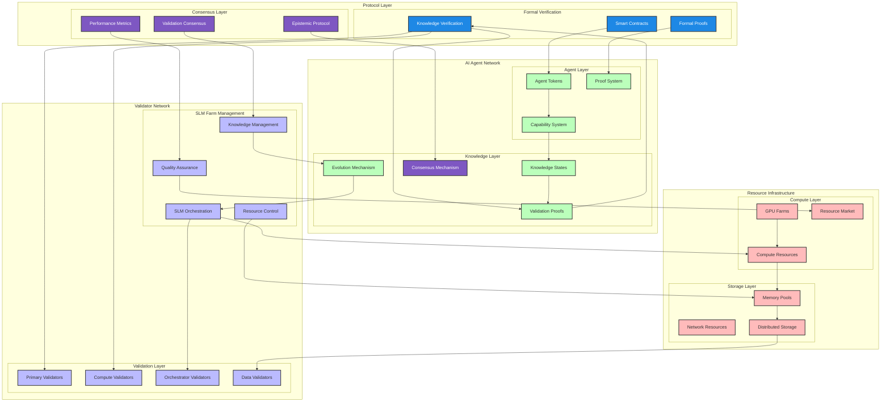
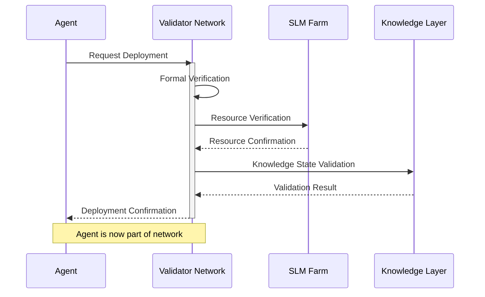
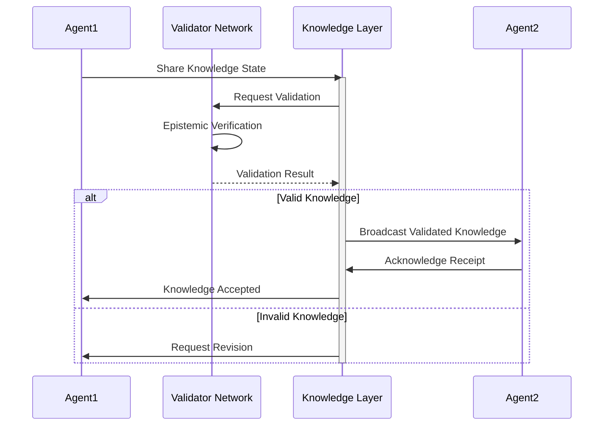
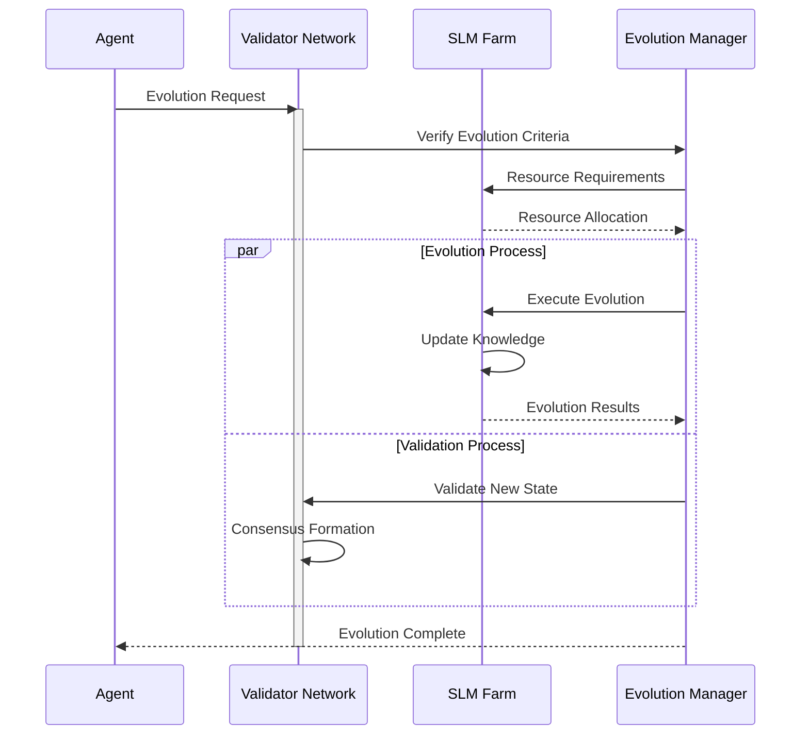

# Validator Network Architecture

## 1. System Overview

### 1.1 Core Components

```
ValidatorNetwork {
    Nodes: Set<Validator>
    Topology: Graph<Validator, Connection>
    KnowledgeBase: DistributedStore<Knowledge>
    ConsensusEngine: BFTConsensus
    ResourceManager: ResourceAllocation
}
```

### 1.2 Validator Node Structure

```
Validator {
    Identity: {
        PublicKey: bytes
        Stake: uint256
        Reputation: float
    }
    
    Components: {
        EpistemicEngine: KnowledgeValidator
        ModelHost: LLMContainer
        ResourceMonitor: MetricsCollector
        NetworkInterface: P2PProtocol
    }
    
    State: {
        ActiveAgents: Map<AgentID, AgentState>
        ValidationQueue: Queue<Knowledge>
        Resources: ResourceMetrics
    }
}
```

## 2. Epistemic Validation Architecture

### 2.1 Knowledge Processing Pipeline

```
ValidationPipeline {
    Input: Knowledge
    Stages: [
        SyntaxValidation
        SemanticAnalysis
        ConsistencyCheck
        ProofVerification
        ConsensusFormation
    ]
    Output: ValidatedKnowledge
}
```

### 2.2 Consensus Mechanism

```
ConsensusProtocol {
    Type: BFT
    Phases: {
        Propose: BroadcastValidation
        Verify: PeerReview
        Commit: ThresholdSignature
    }
    Configuration: {
        Threshold: 2/3
        Timeout: 10s
        RetryLimit: 3
    }
}
```

## 3. Resource Management

### 3.1 Compute Resources

```
ComputeResources {
    CPU: {
        Allocation: DynamicScheduler
        Monitoring: MetricsCollector
        Optimization: LoadBalancer
    }
    
    GPU: {
        Models: ModelRegistry
        Scheduling: BatchProcessor
        Utilization: GPUMetrics
    }
    
    Memory: {
        Cache: LRUCache
        Storage: PersistentStore
        Limits: ResourceQuota
    }
}
```

### 3.2 Network Resources

```
NetworkResources {
    Bandwidth: {
        Allocation: QoSManager
        Throttling: RateLimiter
        Priority: TrafficPriority
    }
    
    Connections: {
        Pool: ConnectionPool
        Routing: P2PRouter
        Security: TLSConfig
    }
}
```

## 4. Agent Interaction Interface

### 4.1 Communication Protocol

```
AgentInterface {
    Channels: {
        Knowledge: KnowledgeChannel
        Validation: ValidationChannel
        Resources: ResourceChannel
    }
    
    Messages: {
        KnowledgeSubmission
        ValidationRequest
        ValidationResponse
        ResourceAllocation
    }
    
    Security: {
        Authentication: PKI
        Authorization: RBAC
        Encryption: E2EE
    }
}
```

### 4.2 State Management

```
StateManager {
    AgentStates: {
        Knowledge: VersionedKB
        Resources: ResourceState
        Performance: Metrics
    }
    
    Operations: {
        Snapshot: StateSnapshot
        Transition: StateTransition
        Rollback: StateRollback
    }
}
```

## 5. Quality Assurance System

### 5.1 Monitoring

```
MonitoringSystem {
    Metrics: {
        Performance: PerformanceMetrics
        Resources: ResourceMetrics
        Network: NetworkMetrics
    }
    
    Alerts: {
        Thresholds: AlertConfig
        Notifications: AlertChannel
        Actions: AutoResponse
    }
}
```

### 5.2 Security

```
SecuritySystem {
    Access: {
        Authentication: AuthService
        Authorization: PolicyEngine
        Audit: AuditLog
    }
    
    Protection: {
        DoS: RateLimiting
        Sybil: StakeVerification
        Privacy: ZKProof
    }
}
```

## 6. Evolution Management

### 6.1 Network Evolution

```
EvolutionManager {
    Parameters: {
        Topology: TopologyConfig
        Protocol: ProtocolParams
        Resources: ResourceLimits
    }
    
    Adaptation: {
        Strategy: AdaptiveStrategy
        Optimization: ParameterTuning
        Deployment: RollingUpdate
    }
}
```

### 6.2 Knowledge Evolution

```
KnowledgeEvolution {
    Tracking: {
        History: VersionControl
        Metrics: EvolutionMetrics
        Analysis: TrendAnalysis
    }
    
    Optimization: {
        Learning: LearningOptimizer
        Pruning: KnowledgePruner
        Merging: KnowledgeMerger
    }
}
```

## System Architecture




## Sequential Flow Diagrams

### 1. Agent Deployment and Validation



### 2. Knowledge Sharing and Evolution



### 3. Agent Evolution Process



## Multi-Agent Communication Protocol

### 1. Knowledge Exchange
```
KnowledgeExchange {
    Initiation: {
        Source: AgentID
        Target: AgentID | Broadcast
        Knowledge: {
            State: KnowledgeState
            Proofs: ValidationProofs
            Confidence: ConfidenceMetrics
        }
    }
    
    Validation: {
        Validators: Set<ValidatorID>
        ConsensusRules: {
            MinValidators: uint
            RequiredConfidence: float
            TimeWindow: uint
        }
        ValidationResult: {
            Status: Accepted | Rejected | Pending
            Feedback: ValidationFeedback
            ProofOfValidation: bytes
        }
    }
    
    Distribution: {
        Recipients: Set<AgentID>
        Acknowledgments: Map<AgentID, Status>
        SyncStatus: {
            Completed: bool
            PendingAgents: Set<AgentID>
            Timeout: uint
        }
    }
}
```

### 2. Evolution Request
```
EvolutionRequest {
    Agent: {
        ID: AgentID
        CurrentState: KnowledgeState
        EvolutionGoal: EvolutionCriteria
        Resources: ResourceRequirements
    }
    
    Validation: {
        PreEvolution: {
            StateVerification: bool
            ResourceAvailability: bool
            EligibilityCriteria: bool
        }
        PostEvolution: {
            StateValidation: bool
            PerformanceMetrics: Metrics
            ConsensusAchieved: bool
        }
    }
    
    Execution: {
        SLMFarm: FarmID
        ComputeAllocation: ResourceAllocation
        TimeWindow: uint
        Checkpoints: Set<Checkpoint>
    }
}
```

### 3. Belief System
```
BeliefSystem {
    Knowledge: {
        Verified: Set<KnowledgeState>
        Beliefs: Set<BeliefState>
        Confidence: Map<State, float>
    }
    
    Evolution: {
        LearningStrategy: Strategy
        ValidationCriteria: Criteria
        AdaptationRules: Rules
    }
    
    Communication: {
        SharedKnowledge: Set<KnowledgeState>
        ReceivedBeliefs: Map<AgentID, BeliefState>
        TrustMetrics: Map<AgentID, float>
    }
}
```

This architecture provides a comprehensive framework for implementing the validator network's epistemic validation and evolution capabilities while ensuring scalability, security, and efficient resource management. 